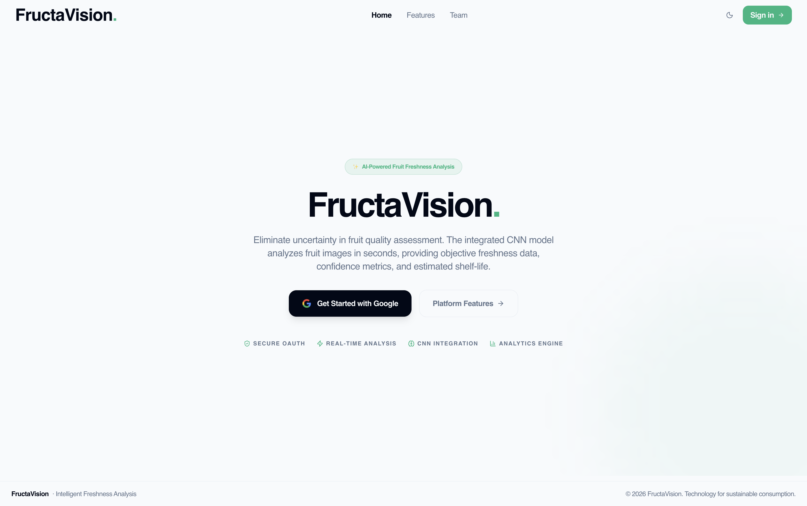
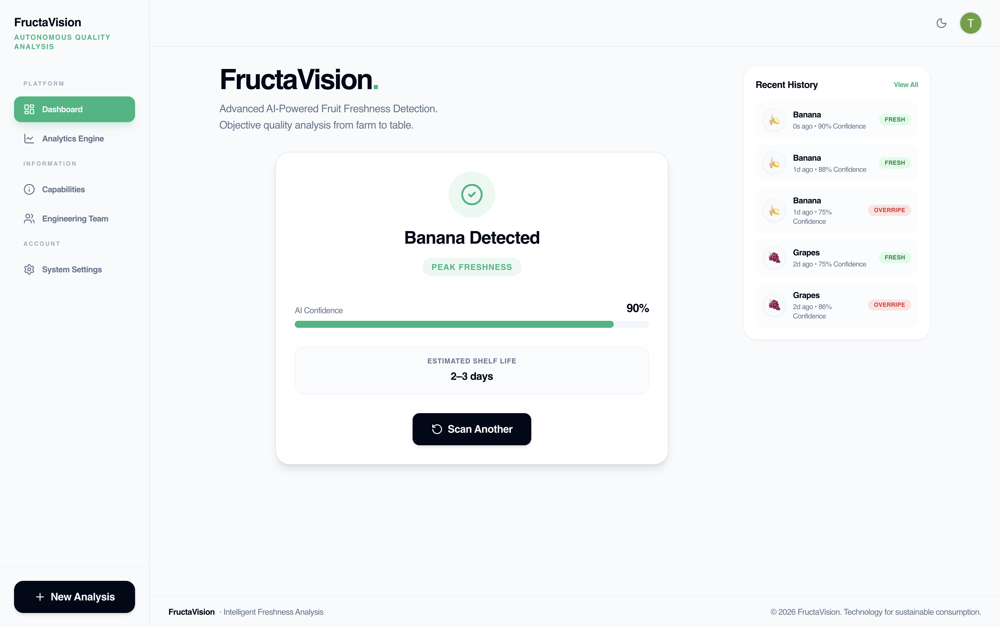
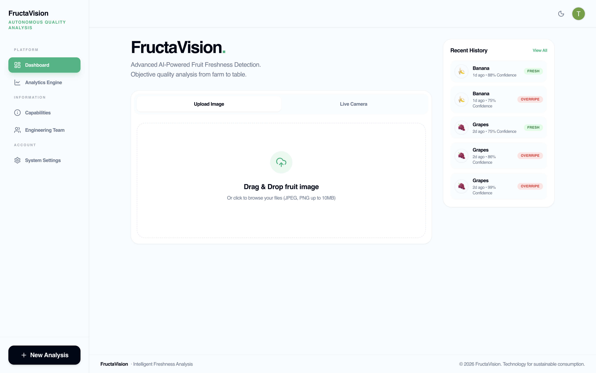
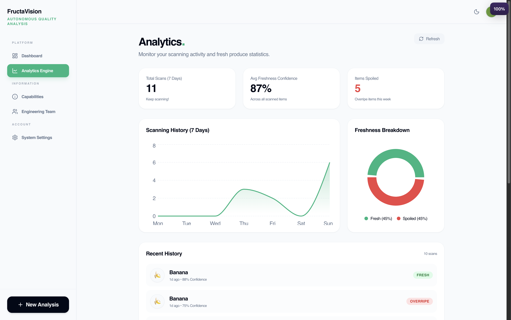

<div align="center">


[](https://fructa-vision.vercel.app)
[](https://react.dev)
[](https://fastapi.tiangolo.com)
[](https://supabase.com)

**An AI-powered fruit quality analysis platform that identifies fruit type, estimates freshness, and predicts shelf life from a single photo.**

[Live Demo](https://fructa-vision.vercel.app) · [Report Bug](https://github.com/itsmeIshaanSharma/FructaVision/issues) · [Request Feature](https://github.com/itsmeIshaanSharma/FructaVision/issues)

</div>

---

## 📸 Screenshots

> 🌐 **Live App:** [https://fructa-vision.vercel.app](https://fructa-vision.vercel.app)

<div align="center">

| Landing / Sign In | Fruit Analysis |
|:-:|:-:|
|  |  |

| Dashboard & Scan History | Analytics |
|:-:|:-:|
|  |  |

</div>

> 📌 To add screenshots: create a `screenshots/` folder in the repo root and add images named `landing.png`, `analysis.png`, `dashboard.png`, `analytics.png`.

---

## 📖 Table of Contents

- [Screenshots](#-screenshots)
- [About](#-about)
- [Features](#-features)
- [Tech Stack](#-tech-stack)
- [How It Works](#-how-it-works)
- [AI Models](#-ai-models)
- [Project Structure](#-project-structure)
- [Getting Started](#-getting-started)
  - [Prerequisites](#prerequisites)
  - [Frontend Setup](#frontend-setup)
  - [Backend Setup](#backend-setup)
  - [Supabase Setup](#supabase-setup)
- [Environment Variables](#-environment-variables)
- [Deployment](#-deployment)
- [API Reference](#-api-reference)
- [Contributing](#-contributing)
- [License](#-license)

---

## 🌟 About

FructaVision uses computer vision and deep learning to analyze fruit quality in real time. Upload a photo or use your camera — the AI instantly classifies the fruit, assesses its freshness, and estimates how many days it will remain usable.

Built with a modern full-stack architecture: a **React + TypeScript** frontend, a **FastAPI** inference server powered by **TensorFlow**, and **Supabase** for authentication and persistent scan history.

---

## ✨ Features

- 🔍 **Fruit Identification** — Classifies apples, bananas, grapes, and guava
- 🌿 **Freshness Detection** — Categorizes fruit as Fresh, Ripe, or Overripe
- 📅 **Shelf Life Estimation** — Predicts remaining usable days based on fruit + freshness
- 📸 **Camera & Upload Support** — Analyze from live camera or image upload
- 🔐 **Google OAuth Login** — Secure sign-in via Supabase Auth
- 📊 **Scan History & Analytics** — Personal dashboard with trend visualization
- ⚡ **90% Confidence Threshold** — Returns "Undefined" for low-confidence predictions instead of guessing
- 🚀 **Vercel-Ready** — Frontend configured with SPA rewrites out of the box

---

## 🛠 Tech Stack

### Frontend
| Technology | Purpose |
|------------|---------|
| React 19 | UI framework |
| TypeScript | Type safety |
| Vite | Build tool & dev server |
| Tailwind CSS | Styling |
| Supabase JS | Auth & database client |

### Backend
| Technology | Purpose |
|------------|---------|
| FastAPI | REST API server |
| TensorFlow (CPU) | Model inference |
| MobileNetV2 | Base CNN architecture |
| Pillow + NumPy | Image preprocessing |
| Uvicorn | ASGI server |

### Data & Auth
| Technology | Purpose |
|------------|---------|
| Supabase Postgres | Scan history storage |
| Row-Level Security | Per-user data isolation |
| Google OAuth | Authentication provider |

---

## 🔄 How It Works

```
User uploads image
       │
       ▼
Frontend sends image → FastAPI /api/analyze
       │
       ├── Fruit Model (MobileNetV2) → apple / banana / grapes / guava
       │
       └── Freshness Model (MobileNetV2) → Fresh / Ripe / Overripe
               │
               ▼
        Shelf Life Lookup Table
               │
               ▼
        Result stored in Supabase
               │
               ▼
        Displayed on Dashboard + Analytics
```

1. User authenticates with Google via Supabase
2. Image is sent to the FastAPI inference endpoint
3. Two independent MobileNetV2 models run in sequence — one for fruit type, one for freshness
4. If fruit confidence < 90%, the result is returned as "Undefined" (no hallucinated outputs)
5. Result is stored in Supabase under the authenticated user's account
6. Analytics page reads scan history and displays trends over time

---

## 🤖 AI Models

Both models use **MobileNetV2** pretrained on ImageNet as a frozen feature extractor, with a custom classification head trained on fruit data.

### Fruit Classification Model
| Property | Value |
|----------|-------|
| Architecture | MobileNetV2 + Dense head |
| Classes | Apple, Banana, Grapes, Guava |
| Input size | 224 × 224 × 3 |
| Final Val Accuracy | **99.4%** |
| Epochs trained | 15 |
| Output | `Dense(4, softmax)` |

### Freshness Classification Model
| Property | Value |
|----------|-------|
| Architecture | MobileNetV2 + Dense head (Functional API) |
| Classes | Fresh, Mid (Ripe), Rotten (Overripe) |
| Input size | 224 × 224 × 3 |
| Training images | 1,833 |
| Final Val Accuracy | **94.8%** |
| Epochs trained | 10 |
| Output | `Dense(3, softmax)` |

**Model files required at runtime:**
- `backend/fruit_model.h5`
- `backend/freshness_model.h5`

> ⚠️ Model files are not included in the repository due to size. Train your own using the notebooks, or contact the author.

---

## 📁 Project Structure

```
FructaVision/
├── backend/
│   ├── main.py              # FastAPI app & inference logic
│   ├── requirements.txt     # Python dependencies
│   └── runtime.txt          # Python version for deployment
├── src/
│   ├── components/          # Reusable React components
│   ├── contexts/            # React context providers (Auth, etc.)
│   ├── layouts/             # Page layout wrappers
│   ├── pages/               # Route-level page components
│   ├── services/            # API call abstractions
│   └── lib/                 # Supabase client & utilities
├── supabase/
│   └── schema.sql           # DB schema, indexes, RLS policies
├── public/                  # Static assets
├── index.html
├── package.json
├── vite.config.ts
├── tailwind.config.js
├── vercel.json              # Vercel SPA rewrite config
└── README.md
```

---

## 🚀 Getting Started

### Prerequisites

- **Node.js** 20+
- **npm** 10+
- **Python** 3.11 (recommended)
- A **Supabase** project with Google OAuth enabled
- Trained model files: `fruit_model.h5` + `freshness_model.h5`

---

### Frontend Setup

1. **Clone the repository**
   ```bash
   git clone https://github.com/itsmeIshaanSharma/FructaVision.git
   cd FructaVision
   ```

2. **Install dependencies**
   ```bash
   npm install
   ```

3. **Create environment file** — create `.env.local` in the project root:
   ```env
   VITE_SUPABASE_URL=your_supabase_project_url
   VITE_SUPABASE_ANON_KEY=your_supabase_anon_key

   # Backend endpoint (required for production)
   VITE_API_ANALYZE_URL=https://your-backend-domain/api/analyze

   # Optional: for local development
   # VITE_API_ANALYZE_URL=http://localhost:8000/api/analyze
   ```

4. **Start the dev server**
   ```bash
   npm run dev
   ```

---

### Backend Setup

1. **Navigate to backend folder**
   ```bash
   cd backend
   ```

2. **Create and activate a virtual environment**
   ```bash
   python3 -m venv .venv
   source .venv/bin/activate        # Linux/macOS
   # .venv\Scripts\activate         # Windows
   ```

3. **Install dependencies**
   ```bash
   pip install -r requirements.txt
   ```

4. **Add model files** — place both files inside the `backend/` folder:
   ```
   backend/
   ├── fruit_model.h5
   ├── freshness_model.h5
   └── main.py
   ```

5. **Start the API server**
   ```bash
   uvicorn main:app --host 0.0.0.0 --port 8000 --reload
   ```

   API will be available at: `http://localhost:8000`  
   Swagger docs at: `http://localhost:8000/docs`

---

### Supabase Setup

1. Create a new project at [supabase.com](https://supabase.com)
2. Enable **Google** as an OAuth provider under **Authentication → Providers**
3. Add your app URL to **Authentication → URL Configuration → Redirect URLs**
4. Open the **SQL Editor** and run the contents of `supabase/schema.sql`

This creates the `scans` table, indexes, and RLS policies so each user can only access their own scan data.

---

## 🔐 Environment Variables

### Frontend (`.env.local`)

| Variable | Required | Description |
|----------|----------|-------------|
| `VITE_SUPABASE_URL` | ✅ | Supabase project URL |
| `VITE_SUPABASE_ANON_KEY` | ✅ | Supabase anon/public key |
| `VITE_API_ANALYZE_URL` | ✅ | Full backend `/api/analyze` URL |
| `VITE_APP_URL` | ❌ | App base URL for OAuth redirect (defaults to `window.location.origin`) |
| `VITE_HF_SPACE_URL` | ❌ | Hugging Face Space base URL (alternative to `VITE_API_ANALYZE_URL`) |

### Backend

| Variable | Default | Description |
|----------|---------|-------------|
| `PORT` | `7860` | Server port (auto-set on HF Spaces) |

---

## 📦 Deployment

### Frontend → Vercel

1. Push the repo to GitHub
2. Import the project in [Vercel](https://vercel.com)
3. Add all `VITE_*` environment variables in **Project Settings → Environment Variables**
4. Deploy — `vercel.json` handles SPA routing automatically

### Backend → Hugging Face Spaces / Render / Railway

1. Deploy the `backend/` folder as a Python web service
2. Ensure `fruit_model.h5` and `freshness_model.h5` are present at runtime
3. Set the `PORT` environment variable if required by the platform
4. Copy the deployed URL and set it as `VITE_API_ANALYZE_URL` in Vercel

---

## 📡 API Reference

### `POST /api/analyze`

Analyzes an uploaded fruit image.

**Request:** `multipart/form-data`
| Field | Type | Description |
|-------|------|-------------|
| `file` | image file | JPEG, PNG, or WebP image |

**Response:** `application/json`
```json
{
  "fruit": "Apple",
  "freshness": "Fresh",
  "confidence": 0.97,
  "shelfLife": "5–7 days"
}
```

**Error responses:**
| Status | Meaning |
|--------|---------|
| `400` | File is not an image |
| `503` | Model files not loaded |
| `500` | Internal server error |

> If fruit confidence is below 90%, `fruit` returns `"Undefined"` and `freshness`/`shelfLife` return `"N/A"`.

---

## 🛠 Available Scripts

From the project root:

| Command | Description |
|---------|-------------|
| `npm run dev` | Start Vite development server |
| `npm run build` | Type-check and build for production |
| `npm run preview` | Preview production build locally |
| `npm run lint` | Run ESLint |

---

## 🐛 Troubleshooting

| Problem | Solution |
|---------|----------|
| `Missing Supabase env` error | Set `VITE_SUPABASE_URL` and `VITE_SUPABASE_ANON_KEY` in `.env.local` |
| `503 Models not loaded` | Confirm `fruit_model.h5` and `freshness_model.h5` are inside `backend/` |
| CORS or network error | Verify frontend URL matches the allowed origins in backend CORS config |
| OAuth not redirecting back | Add correct redirect URLs in Supabase Auth settings |
| All predictions return "Undefined" | Fruit model confidence < 90% — verify image quality or model file integrity |

---

## 🤝 Contributing

Contributions are welcome! Here's how to get started:

1. Fork the repository
2. Create a feature branch: `git checkout -b feature/your-feature-name`
3. Commit your changes: `git commit -m 'Add some feature'`
4. Push to the branch: `git push origin feature/your-feature-name`
5. Open a Pull Request

Please make sure your code lints cleanly (`npm run lint`) before submitting.

---

<div align="center">
</div>
